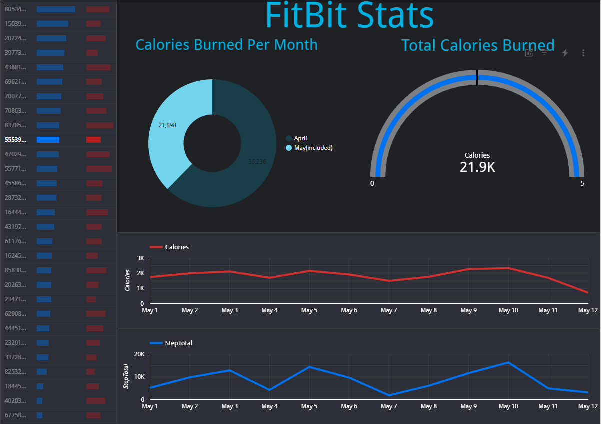

# BigQuery-and-the-Cloud

#### By Reed Carter

#### A Breakdown of FitBit data for 33 Users 

## Technologies Used

* github
* python
* pandas
* jupyterlab
* BigQuery
* Looker Studio

## Description

This is series of visualizations made from FitBit data which displays the step count vs calories burned. The dataset was downloaded from kaggle which was generated by respondents to a distributed survey via Amazon Mechanical Turk between 03.12.2016-05.12.2016. Thirty eligible Fitbit users consented to the submission of personal tracker data output for step count, calories burned,heart rate, and sleep monitoring. The visualizations have drill down capabilities therefore, data for each individual id can be selected using the id_table and the step count and calories burned will update to be specific to that particular id. The pie chart also has drill down capabilities. Therefore the data visualization can be queried to only display data for a particular month by selecting the desired month on the pie chart. A complete repository can be found here: https://github.com/Reed-Carter/BigQuery-and-the-Cloud.git

## Setup/Installation Requirements

* Clone this repository to your desktop
* Navigate to the top level directory
* Run 'pip install -r requirements.txt' to install all the requirements so that main.py can run correctly
* Open main.py

## Known Bugs

* no known bugs

## License

MIT License

Copyright (c) [2022] [Reed Carter, Chloe Le, Phil Kendall]

Permission is hereby granted, free of charge, to any person obtaining a copy
of this software and associated documentation files (the "Software"), to deal
in the Software without restriction, including without limitation the rights
to use, copy, modify, merge, publish, distribute, sublicense, and/or sell
copies of the Software, and to permit persons to whom the Software is
furnished to do so, subject to the following conditions:

The above copyright notice and this permission notice shall be included in all
copies or substantial portions of the Software.

THE SOFTWARE IS PROVIDED "AS IS", WITHOUT WARRANTY OF ANY KIND, EXPRESS OR
IMPLIED, INCLUDING BUT NOT LIMITED TO THE WARRANTIES OF MERCHANTABILITY,
FITNESS FOR A PARTICULAR PURPOSE AND NONINFRINGEMENT. IN NO EVENT SHALL THE
AUTHORS OR COPYRIGHT HOLDERS BE LIABLE FOR ANY CLAIM, DAMAGES OR OTHER
LIABILITY, WHETHER IN AN ACTION OF CONTRACT, TORT OR OTHERWISE, ARISING FROM,
OUT OF OR IN CONNECTION WITH THE SOFTWARE OR THE USE OR OTHER DEALINGS IN THE
SOFTWARE.